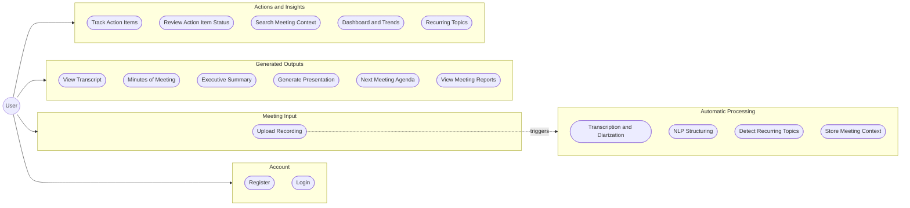
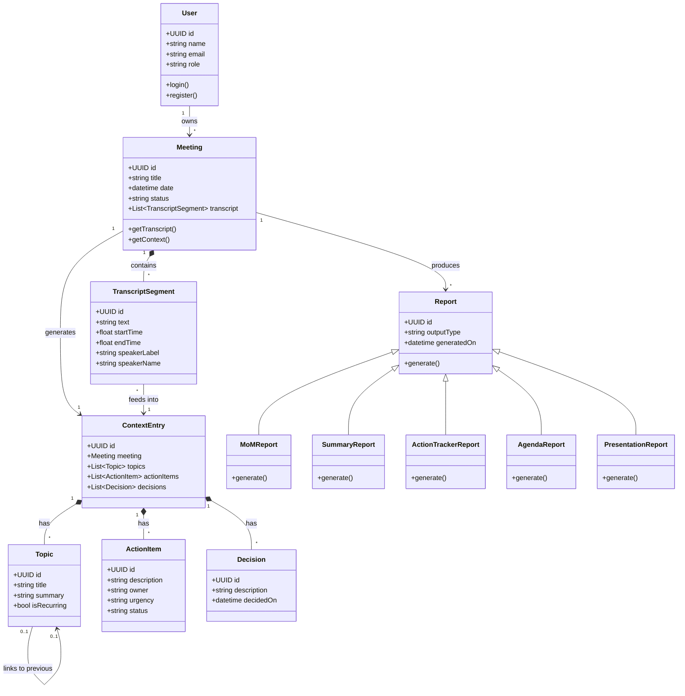
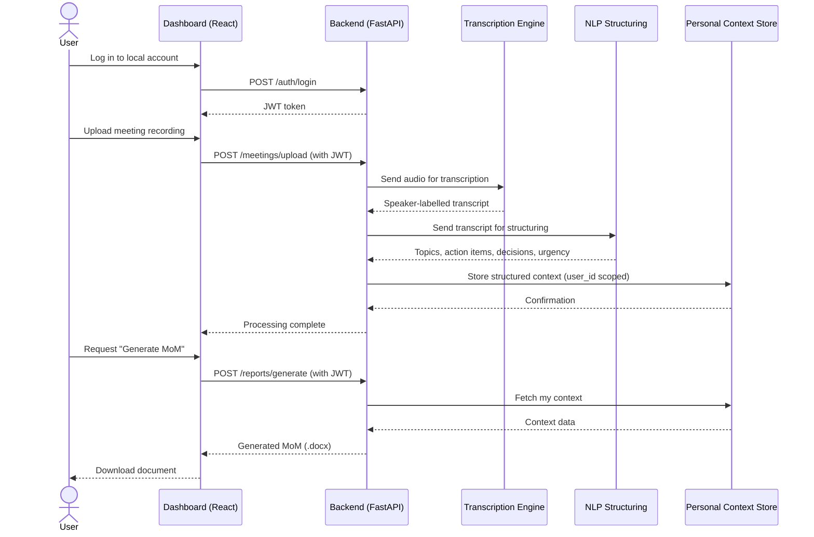
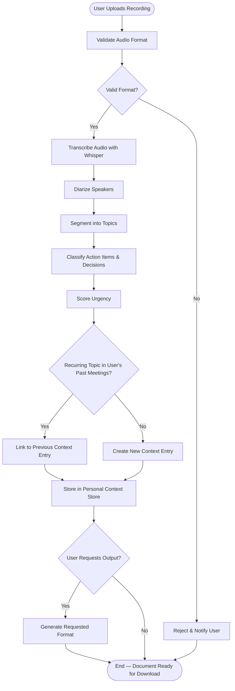
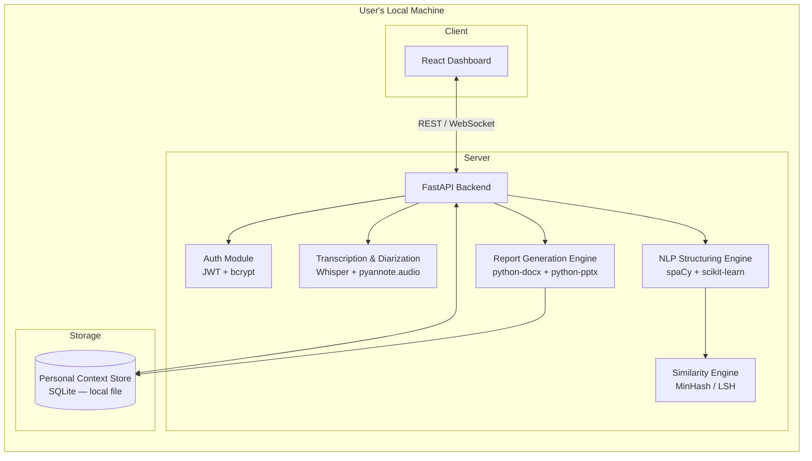
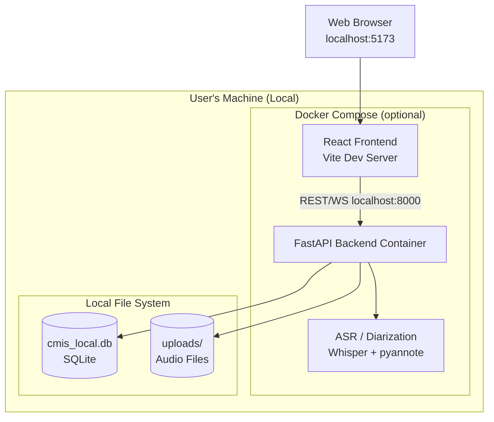
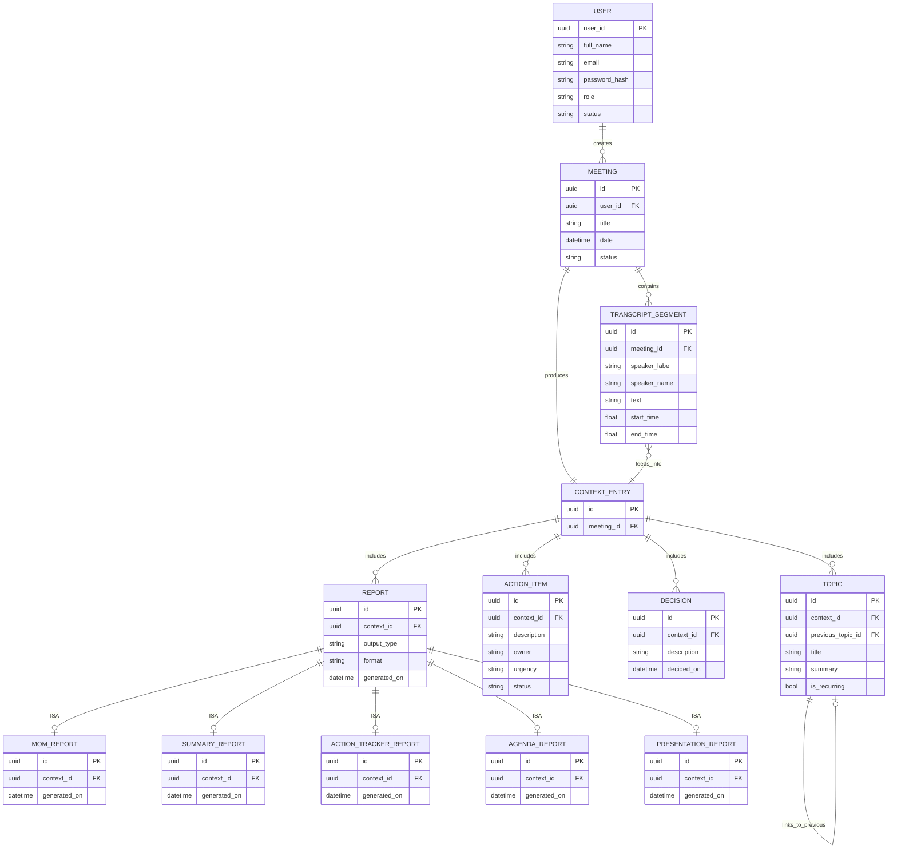
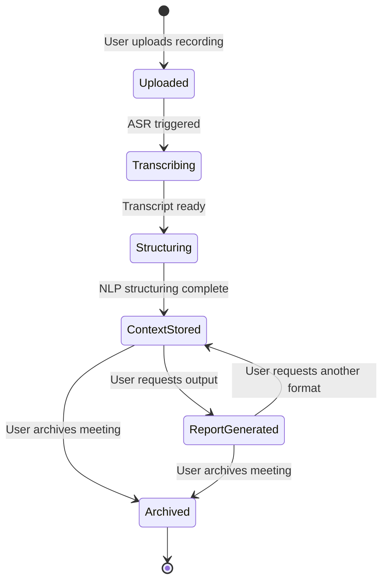

# CMIS — UML Diagrams

All diagrams below use **Mermaid** syntax. They render natively on GitHub, GitLab, VS Code (with the Mermaid extension), Obsidian, and most modern Markdown viewers. If your viewer doesn't render Mermaid, paste any block into [mermaid.live](https://mermaid.live) to preview and export as PNG/SVG.

---

## 1. Use Case Diagram

Single actor (User) on the left; all use cases on the right, grouped by subsystem.



---

## 2. Class Diagram

Core domain model of CMIS — Report subtypes use inheritance as per the reference diagram.



---

## 3. Sequence Diagram

Flow from audio upload to report generation — single user interaction.



---

## 4. Activity Diagram

End-to-end processing pipeline with decision points.



---

## 5. Component Diagram

High-level system architecture — all components run locally on the user's machine.



---

## 6. Deployment Diagram

Physical deployment — everything runs on the user's own laptop or desktop.



---

## 7. Entity–Relationship (ER) Diagram

Database schema for the personal context store — includes ISA inheritance for Report subtypes as per the reference diagram.



---

## 8. State Diagram

Lifecycle of a single meeting record within the personal context store.



---

## How to export these as images

1. Copy any code block (including the ` ```mermaid ` fence) into [mermaid.live](https://mermaid.live)
2. Click **Actions → Export as PNG/SVG**
3. Insert the exported image into your Word report or PPT wherever a diagram is required

Alternatively, install the **Markdown Preview Mermaid Support** extension in VS Code to preview and export directly from your editor.
